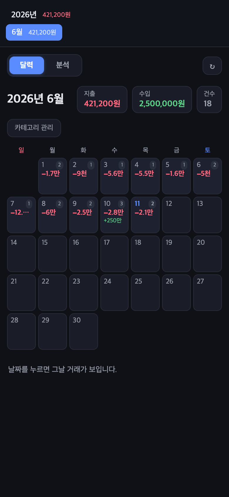
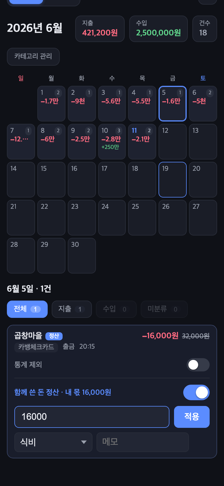
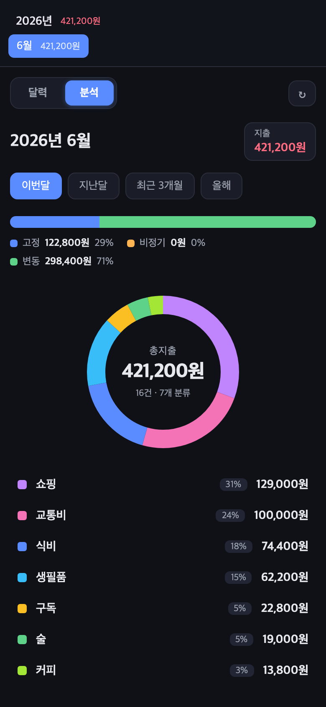

# spending-tracker

카드/계좌 결제 SMS를 자동 수집해 소비 패턴을 기록·분석하는 개인용 시스템.

결제 문자가 오면 **iOS 단축어**가 자동으로 서버 webhook에 전송하고, 서버가 파싱해 SQLite에 저장한다. 달력형 웹 UI에서 일별 지출/수입 확인, 카테고리·메모 관리, 더치페이 정산, 카테고리별 분석(도넛 차트)을 할 수 있다.

```
결제 SMS ──> iOS 단축어 (자동화) ──> POST /sms (사설망, 토큰 인증)
                                        │
                                   parse.js (SMS 파서)
                                        │
                                   SQLite (spending.db)
                                        │
                                   웹 UI (달력 + 분석)
```

## 스크린샷 (모바일)

| 달력 뷰 | 거래 상세 (정산 토글) | 분석 뷰 |
|---|---|---|
|  |  |  |

*스크린샷은 데모 데이터입니다.*

## 특징

- **수동 입력 없음** — 결제 문자만 오면 자동 기록 (카카오뱅크 체크카드/계좌, 현대카드 검증 완료)
- **외부 서비스 0** — 오픈뱅킹·마이데이터·스크래핑 불사용. 데이터가 내 기기 밖으로 안 나감
- **사설망 전용** — Tailscale 등 VPN 내부 IP에만 바인딩. 공개 인터넷 노출 없음
- 의존성 단 2개 (express, better-sqlite3), 프론트는 vanilla JS 단일 파일

## 요구사항

- Node.js 18+
- 서버로 쓸 상시 구동 머신 (예: macOS 데스크탑/서버)
- 폰과 서버를 묶는 사설망 (Tailscale 권장 — 폰에서 서버 IP로 직접 접근 가능해야 함)
- iPhone (단축어 자동화 "바로 실행" 지원 버전), 카드/은행 SMS 알림 활성화

## 설치

```bash
git clone <이 리포지토리 URL>
cd spending-tracker/server
npm install
```

DB(`spending.db`)는 첫 실행 시 자동 생성되고, 스키마 변경도 기동 시 자동 마이그레이션된다. 별도 DB 셋업 불필요.

### 1. 시크릿 파일 생성 (필수 — 없으면 서버가 시작되지 않음)

`server/` 디렉토리 안에서:

```bash
# webhook 토큰 (단축어가 사용)
openssl rand -hex 16 > .webhook_token
# 웹 UI 비밀번호 (Basic Auth 활성화 시 사용)
echo '원하는비밀번호' > .web_password
chmod 600 .webhook_token .web_password
```

### 2. 바인딩 주소 설정

바인딩 주소는 `BIND_ADDR` 환경변수로 지정한다 (미지정 시 `127.0.0.1` — 로컬 테스트만 가능).
폰에서 webhook이 도달하려면 **사설망 IP(Tailscale IP 등)로 설정해야 한다.**
`0.0.0.0` 바인딩 금지 — 금융 데이터다.

```bash
BIND_ADDR=100.x.y.z PORT=8080 node index.js
```

### 3. 실행

```bash
node index.js
# spending-tracker (UI+webhook) on http://<BIND>:8080
```

확인: `curl http://<BIND>:8080/health` → `{"ok":true,"count":N,...}`

폰 없이 파이프라인을 테스트하려면 가짜 결제 SMS를 직접 쏴보면 된다:

```bash
curl -X POST "http://<BIND>:8080/sms?token=$(cat .webhook_token)" \
  -H 'Content-Type: application/json' \
  -d '{"text":"[Web발신]\n[카카오뱅크]\n홍*동(1234)\n06/11 12:00\n출금 4,500원\n스타벅스\n잔액 100,000원"}'
# → {"ok":true,"id":1,...} 이면 웹 UI 달력에 바로 나타난다
```

### 4. (macOS) launchd 상시 구동

`~/Library/LaunchAgents/com.<user>.spending-tracker.plist` 생성:

```xml
<?xml version="1.0" encoding="UTF-8"?>
<!DOCTYPE plist PUBLIC "-//Apple//DTD PLIST 1.0//EN" "http://www.apple.com/DTDs/PropertyList-1.0.dtd">
<plist version="1.0"><dict>
  <key>Label</key><string>com.USER.spending-tracker</string>
  <key>ProgramArguments</key><array>
    <string>/opt/homebrew/bin/node</string>
    <string>/절대경로/spending-tracker/server/index.js</string>
  </array>
  <key>WorkingDirectory</key><string>/절대경로/spending-tracker/server</string>
  <key>EnvironmentVariables</key><dict>
    <key>BIND_ADDR</key><string>100.x.y.z</string>
  </dict>
  <key>RunAtLoad</key><true/>
  <key>KeepAlive</key><true/>
  <key>StandardOutPath</key><string>/절대경로/spending-tracker/server/server.log</string>
  <key>StandardErrorPath</key><string>/절대경로/spending-tracker/server/server.err.log</string>
</dict></plist>
```

```bash
launchctl bootstrap gui/$(id -u) ~/Library/LaunchAgents/com.USER.spending-tracker.plist
# 코드 수정 후 재시작:
launchctl kickstart -k gui/$(id -u)/com.USER.spending-tracker
```

웹 UI(`public/`) 수정은 재시작 불필요. `index.js`/`parse.js` 수정 시만 kickstart.

## iOS 단축어 설정

은행/카드사별로 자동화를 하나씩 만든다:

1. 단축어 앱 → 자동화 → 새 자동화 → **메시지**
2. 조건: 메시지에 `카카오뱅크`(또는 `현대카드` 등 발신 문자에 항상 포함되는 키워드) 포함
3. **"즉시 실행"(바로 실행)** 켜기 — 확인 없이 자동 동작
4. 동작: **URL 콘텐츠 가져오기**
   - URL: `http://<서버IP>:8080/sms?token=<webhook_token>`
   - 방식: POST, 요청 본문: JSON, `text` = (단축어 입력 → 메시지 내용)
5. 폰의 VPN(Tailscale)을 상시 ON으로 유지 — 꺼져 있으면 webhook이 서버에 도달하지 못한다

거래 문자가 아닌 것(인증번호·광고)은 서버 파서가 알아서 무시하므로 조건을 느슨하게 잡아도 된다.

### 지원 SMS 포맷 (parse.js)

| 출처 | 형태 | 비고 |
|---|---|---|
| 카카오뱅크 체크카드/계좌 | 멀티라인 (`출금/입금/승인 N원`, 잔액 포함) | 마스킹 계좌주 자동 제거 |
| 현대카드 | `<카드명> 승인` 라인 포맷 | 카드명이 `source`로 저장돼 복수 카드 구분 |

다른 은행/카드는 `parse.js`에 파서를 추가하면 된다. 판별 규칙: **금액 + 거래유형 + 출처**가 모두 파싱돼야 저장.

## 웹 UI

`http://<서버IP>:8080` 접속.

- **달력 뷰**: 월간 달력에 일별 지출(빨강)/수입(초록), 사이드바에 연/월별 합계
- **거래 관리**: 날짜 클릭 → 거래별 카테고리 드롭다운, 메모, 정산 토글(더치페이 시 내 실제 부담액만 통계 반영), 통계 제외 토글
- **카테고리 관리**: 추가/삭제, 고정/비정기/변동 3그룹 지정
- **분석 탭** (`?view=stat` 딥링크): 카테고리별 도넛 차트, 기간 선택·전기간 대비 증감, 고정/비정기/변동 그룹 막대, Top5 가맹점

## API

| 메서드 | 경로 | 인증 | 설명 |
|---|---|---|---|
| GET | `/health` | 없음 | 헬스체크 (건수·시각) |
| POST | `/sms` | 토큰 (`?token=` / `X-Token` 헤더 / body) | SMS 수신 webhook |
| GET | `/api/transactions?limit=` | webAuth | 거래 목록 (기본 500, 최대 2000) |
| PATCH | `/api/transactions/:id` | webAuth | memo / category / settled / my_amount / excluded 수정 |
| GET | `/api/categories` | webAuth | 카테고리 + 그룹 매핑 |
| POST | `/api/categories` | webAuth | 카테고리 추가 (`{name, grp?}`) |
| PATCH | `/api/categories/:name` | webAuth | 그룹 변경 (`{grp: fixed\|irregular\|variable}`) |
| DELETE | `/api/categories/:name` | webAuth | 카테고리 삭제 (기존 거래의 값은 유지) |

## 보안 모델 (반드시 읽을 것)

이 프로젝트는 **금융 데이터**를 다룬다. 설계상 안전장치와 운영자가 지켜야 할 것:

1. **사설망 전용 바인딩** — 서버는 VPN(Tailscale) IP에만 바인딩한다. 공인 IP·`0.0.0.0` 바인딩, 포트포워딩, 리버스 프록시 공개 절대 금지.
2. **webhook 토큰 인증** — `/sms`는 `.webhook_token` 일치 시에만 저장. 토큰은 URL 쿼리로 전달되므로 사설망 전제에서만 안전하다.
3. **웹 UI 인증은 기본 비활성** — `index.js`의 `webAuth`가 no-op이다 (사설망 전제). 사설망 구성이 다르거나 공유 네트워크라면 `webAuth`를 `webAuthBasic`으로 교체해 Basic Auth(`.web_password`)를 활성화할 것.
4. **커밋 금지 대상** — `.webhook_token`, `.web_password`, `spending.db*`(거래 원문·가맹점·잔액 포함), `*.log`(SMS 원문 로깅됨). 전부 `.gitignore`에 등재돼 있다. **DB와 로그에는 SMS 원문(raw)이 그대로 저장되므로 절대 공개 저장소에 올리지 말 것.**
5. **데이터 외부 전송 없음** — 서버는 어떤 외부 API도 호출하지 않는다.

## 라이선스 / 면책

개인 용도로 작성됨. SMS 파싱 포맷은 각 금융사 알림 문구 변경 시 깨질 수 있다.
